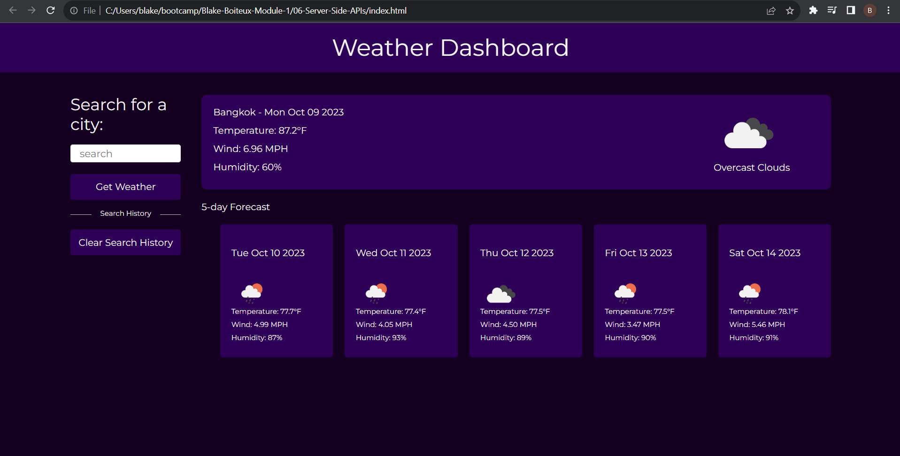

# Server-Side-APIs

User Story

AS A traveler
I WANT to see the weather outlook for multiple cities
SO THAT I can plan a trip accordingly

Acceptance Criteria

GIVEN a weather dashboard with form inputs
WHEN I search for a city
THEN I am presented with current and future conditions for that city and that city is added to the search history
WHEN I view current weather conditions for that city
THEN I am presented with the city name, the date, an icon representation of weather conditions, the temperature, the humidity, and the the wind speed
WHEN I view future weather conditions for that city
THEN I am presented with a 5-day forecast that displays the date, an icon representation of weather conditions, the temperature, the wind speed, and the humidity
WHEN I click on a city in the search history
THEN I am again presented with current and future conditions for that city

Screenshots of deployed app:

Screenshot 1 - 

Sources that were used during this assignment came from class in canvas, as well as through the resources listed below:

Display Search History in Html JavaScript and jQuery https://youtu.be/IrQss691cdE?si=W94YN8Nt_bW5_g1V by Web Dev

Build A Weather App in HTML CSS and JavaScript | Weather App Project HTML CSS and JavaScript https://youtu.be/SeXg3AX82ig?si=5GkSrwhi4niJ5_dd by CodingNepal

ChatGPT by OpenAI @ https://openai.com/blog/chatgpt
